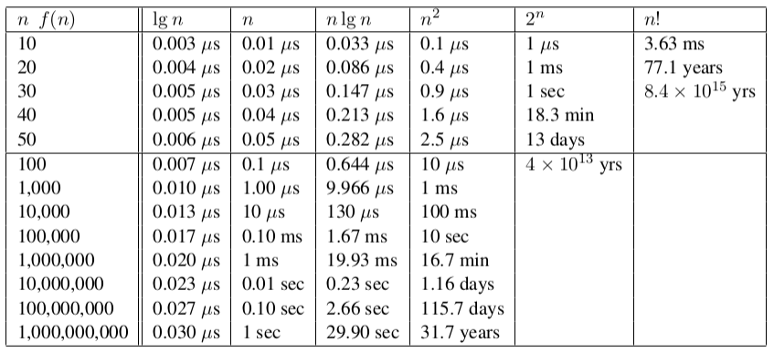

# 3 Program Analysis

## Multiplication and the Big Oh

### Big Oh Multiplication by a Constant

- multiplication by a constant does not change the asymptotics:
  - O(c * f(n)) -> O(f(n))
  - Ω(c * f(n)) -> Ω(f(n))
  - Θ(c * f(n)) -> Θ(f(n))
- the old constant C from the Big Oh becomes c * C

### Big Oh Multiplication by a Function

- when both functions in a product are increasing, both are important:
  - O(f(n)) * O(g(n)) -> O(f(n) * g(n))
  - Ω(f(n)) * Ω(g(n)) -> Ω(f(n) * g(n))
  - Θ(f(n)) * Θ(g(n)) -> Θ(f(n) * g(n))
- this is why the running time of two nested loops is O(n^2)

## Analyzing Algorithms: Selection and Insertion Sort

### Reasoning About Efficiency

- grossly reasoning about the running time of an algorithm is usually easy given a precise-enough written description of the algorithm
- when you really understand an algorithm, this analysis can be done in your head; however, recognize there is always implicitly a written algorithm/program we are reasoning about

Selection Sort

```java
void selection_sort(item_type s[], int n) {
  int i, j; /* counters */
  int min;  /* index of minimum */
  for (i = 0; i < n; i++) {
    min = i;
    for (j = i + 1; j < n; j++) {
      if (s[j] < s[min]) {
        min = j;
      }
    }
    swap(&s[i], &s[min]);
  }
}
```

Worst Case Analysis
- the outer loop goes around n times
- the inner loop goes around at most n times for each iteration of the outer loop
- thus, selection sort takes at most n*n -> O(n^2) time in the worst case
- in fact, it is Θ(n^2), because at least n/2 times it scans through at least n/2 elements, for a total of at least (n^2)/4 steps

Insertion Sort

```java
void insertion_sort(item_type s[], int n) {
  int i, j;  /* counters */
  for (i = 1; i < n; i++) {
    j = i;
    while ((j > 0) && (s[j] < s[j - 1])) {
      swap(&s[j], &s[j - 1]);
      j = j-1;
    }
  }
}
```

Worst Case Analysis
- this involves a while loop, so the analysis is less mechanical
- but n calls to an inner loop which takes at most n steps on each call is O(n^2)
- the reverse-sorted permutation proves that the worst-case complexity is Θ(n^2): (10,9,8,7,6,5,4,3,2,1)

## Asymptotic Dominance



Implications of Dominance:
- exponential algorithms get hopeless fast
- quadratic algorithms get hopeless at or before 1,000,000
- O(n log n) is possible to about one billion
- O(log n) never sweats

## Determining Asymptotic Dominance

Testing Dominance
- f(n) dominates g(n) if lim(n->inf) g(n) / f(n) = 0, which is the same as saying g(n) = o(f(n))
- the little oh means "grows strictly slower than"

Properties of Dominance
- n^a dominates n^b if a > b since lim(n->inf) n^b / n ^a = n^(b-a) -> 0
- n ^ a + o(n^a) doesn't dominate n^a since lim(n->inf) n^a / (n^a + o(n^a)) -> 1

Dominance Rankings
- n! >> 2^n >> n^3 >> n^2 >> n log n >> n >> log n >> 1

Advances Dominance Rankings
- n! >> c^n >> n^3 >> n^2 >> n^(1+epsilon) >> n log n >> n >> sqrt(n) >> log^2 n >> log n >> (log n) / (log log n) >> log log n >> alpha(n) >> 1

## Logarithms

Logarithms
- a logarithm is simply an inverse exponential function; saying b^z = y is equivalent to saying that x = logb y
- logarithms reflect how many times we can double something until we get to n, or halve something until we get to 1

Binary Search
- in binary search we throw away half the possible number of keys after each comparison
- thus, twenty comparisons suffice to find any name in a million name phone book
- how many time can we halve n before getting to 1 -> log n

Logarithms and Trees
- how tall a binary tree do we need until we have n leaves?
- the number of potential leaves doubles with each level
- how many times can we double 1 until we get to n? log n

Logarithms and Bits
- how many bits do you need to represent the numbers from 0 to 2^i - 1?
- each bit you add doubles the possible number of bit patterns, so the number of bits equals log(2 ^ i) = i

Logarithms and Multiplication
- recall that loga xy = loga x + loga y

The Base is not Asymptotically Important
- recall the definition c^(logc x) = x and that logb a = logc a / logc b
- thus log2 n = (1 / log100 2) * log100 n
- since 1 / log100 2 = 6.643 is just a constant, it does not matter in the Big Oh
