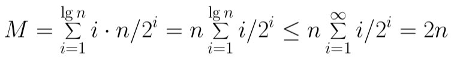

# 4 Elementary Data Structures

## Elementary Data Structures

### Elementary Data Structures

- "Mankind's progress is measured by the number of things can do without thinking."
- elementary data structures such as stacks, queues, lists and heaps are the "off-the-shelf" components we build our algorithm from
- there are two aspects to any data structure:
  - the abstract operations which it supports
  - the implementation of these operations

### Data Abstraction

- that we can describe the behavior of our data structures in terms of abstract operations is why we can use them without thinking
  - Push(x, s) - insert item x at the top of stack s
  - Pop(s) - return (and remove) the top item of stack s
- that there are different implementations of the same abstract operations enables us to optimize performance in different circumstances

### Contiguous vs Linked Data Structures

- data structures can be neatly classified as either contiguous or linked depending upon whether they are based on arrays or pointers
- contiguous allocated structures are composed of single slabs of memory, and include arrays, matrices, heaps and hash tables
- linked data structures are composed of multiple distinct chunks of memory bound together by pointers, and include lists, trees, and graph adjacency lists

## Arrays

Arrays:
- an array is a structure of fixed-size data records such that each element can be efficiently located by its index or equivalent address
- advantages od contiguous allocated arrays include:
  - constant time access given the index
  - arrays consist purely of data, so no space is wasted with links or other formatting information
  - physical continuity (memory locality) between successive data accesses helps exploit the high speed cache memory on modern computer architectures

Dynamic Arrays
- unfortunately we cannot adjust the size of simple arrays in the middle of a program's execution
- compensating by allocating extremely large arrays can waste a lot of space
- with dynamic arrays we start with an array of size 1, and double its size from m to 2m each time we run out of space
- how many times will we double for n elements? only log2 n

How Much Total Work?
- the apparent waste in this procedure involves the recopying of the old contents on each expansion
- if half of the elements move once, s quarter of the elements move twice, and so, on
- therefore the total number of movements M is:



- thus, each of the n elements move an average of only twice, and the total work of managing the dynamic array is the same O(n) as a simple array
- geometric series convergence is the free lunch of algorithm analysis

Sentinels
- boundary conditions can be eliminated using a sentinel element which doesn't go away
- initializing the empty array or list to contain an item with key (infinity) ensures that:
  - the empty list condition never can occur, and this never needs to be tested
  - no inserted element will ever be minimum, so insertion sort never test for the boundary of the array
- nothing changes with the Big Oh, but this can simplify code if done correctly

## Linked Structures

Pointers and Linked Structures
- pointers represent the address of a location in memory
- analogy: a cell phone number is a pointer to its owner as they move about the planet
- in C, *p denotes the item pointed to by p, and &x denotes the address (ie pointer) of a particular variable x
- a special NULL pointer value is used to denote structure terminating or unassigned pointers

Linked List Structures

```c++
typedef struct list {
  item_type item;    /* data item */
  struct list *next; /* point to successor */
} list;
```

Searching a List
- searching in a linked list can be done iteratively or recursively

```c++
list *search_list(list *l, item_type x) {
  if (l == NULL) {
    return(NULL);
  }
  if (l->item == x) {
    return(l);
  } else {
    return(search_list(l->next, x));
  }
}
```

Insertion into a List
- since we have no need to maintain the list in any particular order, we might as well insert each new item at the head
- note the **l since the head element of the list changes

```c++
void insert_list(list **l, item_type x) {
  list *p; /* temporary pointer */
  p = malloc(sizeof(list));
  p->item = x;
  p->next = *l;
  *l = p;
}
```

Deleting from a List: Find Predecessor

```c++
list *item_ahead(list *l, list *x) {
  if ((l == NULL) || (l->next == NULL)) {
    return(NULL);
  }
  if ((l->next) == x) {
    return(l);
  } else {
    return(item_ahead(l->next, x));
  }
}
```

Deleting from a List: Remove Item

```c++
void delete_list(list **l, list **x) {
  list *p;    /* item pointer */
  list *pred; /* predecessor pointer */
  p = *l;
  pred = item_ahead(*l, *x);
  if (pred == NULL) { /* splice out of list */
    *l = p->next;
  } else {
    pred->next = (*x)->next;
  }
  free(*x); /* free memory used by node */
}
```

Advantages of Linked Lists
- the relative advantages of linked lists over static arrays include
  - overflow on linked structures can never occur unless the memory is actually full
  - insertions and deletions are simpler than for contiguous (array) lists
  - with large records, moving pointers is easier and faster than moving the items themselves
- dynamic memory allocation provides us with flexibility on how and where we use our limited resources

Singly or Doubly Linked Lists
- we gain extra flexibility on predecessor queries at a cost of doubling the number of points by using doubly linked lists
- since the extra big oh costs of doubly linked lists is zero, we will usually assume they are so maintained, although it might not always be necessary

## Containers

Stacks and Queues
- sometimes, the order in which we retrieve data is independent of its content, being only a function of when it arrived
- a stack supports last in, first out (LIFO) operations:
  - Push(x, s) - insert item x at the top of stack s
  - Pop(s) - return and remove the top item of stack s
- a queue supports first-in, first-out operations:
  - Enqueue(x, q) - insert item x at the back of queue q
  - Dequeue(q) - return and remove the front item from queue q

Stack/Queue implementations
- stacks are more easily represented as an array, with push/pop incrementing and decrementing a counter
- queues are more easily represented as a linked list, with enqueue/dequeue on opposite ends of the lists
- all operations can be done in O(1) time for both structures, with both arrays and lists

Why Stacks and Queues?
- both are appropriate for a container class where order doesn't matter, but sometime it does matter
- lines in banks are based on queues, while food in a refrigerator is treated as a stack
- the entire difference between depth-first search (DFS) and breadth-first search (BFS) is whether a stack or a queue holds the vertices/items to be processed

## Dictionary Data Structures

Dictionary/Dynamic Set Operations
- perhaps the most important class of data structures maintain a set of items, indexed by keys
  - Search(S, k) - a query that, given a set S and a key value k, returns a pointer x to an element in S such that key[x] = k, or nil if no such element belongs to S
  - Insert(S, x) - a modifying operation that augments the set S with the element x
  - Delete(S, x) - given a pointer x to an element in the set S, remove x from S. Observe we are given a pointer to an element x, not a key value
  - Min(S), Max(S) - returns the element of the totally ordered set S which has the smallest (largest) key
  - Logical Predecessor(S, x), Successor(S, x) - given an element x whose key if from a totally ordered set S, returns the next smallest (largest) element in S, or NIL if x is the maximum (minimum) element
- there are a variety of implementations of these dictionary operations, each of which yield different time bounds for various operations
- there is an inherent tradeoff between these operations; we will see that no single implementation will achieve the best time bound for all operations

Array Based Sets: Unsorted Arrays

| Operation | Implementation | Big Oh
|--|--|--|
| Search(S, k) | sequential search | O(n) |
| Insert(S, x) | place in first empty spot | O(1) |
| Delete(S, x) | copy nth item to xth spot | O(1) |
| Min(S, x), Max(S, x) | sequential search | O(n) |
| Successor(S, x), Predecessor(S, x) | sequential search | O(n) |

Array Based Sets: Sorted Arrays

| Operation | Implementation | Big Oh
|--|--|--|
| Search(S, k) | binary search | O(log n) |
| Insert(S, x) | search, then move to make space | O(n) |
| Delete(S, x) | move to fill up the hole | O(n) |
| Min(S, x), Max(S, x) | first or last element | O(1) |
| Successor(S, x), Predecessor(S, x) | add or subtract 1 from pointer | O(1) |