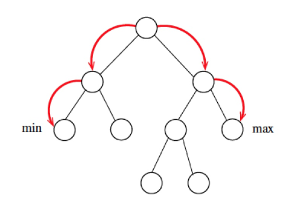
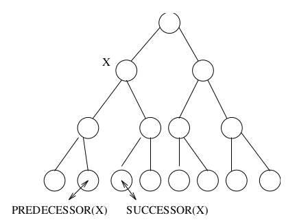
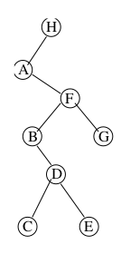
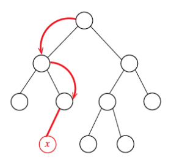
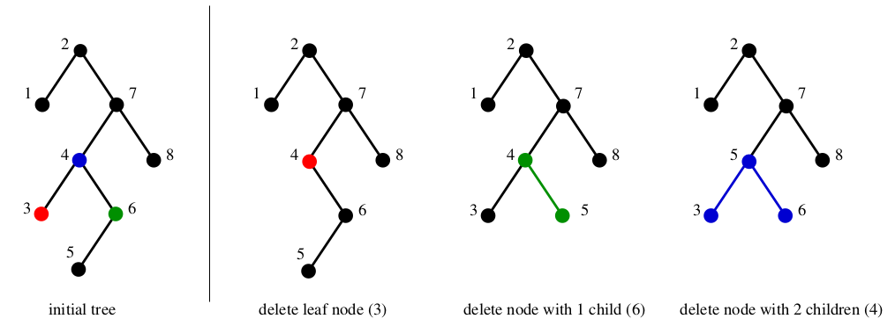
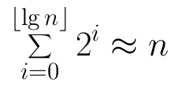
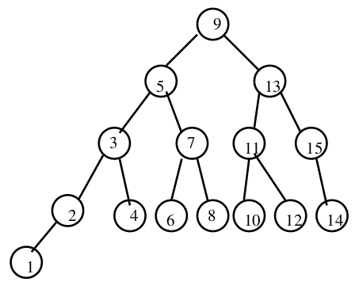

# 5 Dictionaries

## Problem of the Day

- what is the asymptotic worst-case running times for each of the seven fundamental dictionary operations when the data structure is implemented as:
  - a singly linked unsorted list
  - a singly linked sorted list
  - a doubly linked unsorted list
  - a doubly linked sorted list

| | singly unsorted | singly sorted | doubly unsorted | doubly sorted |
|-|-|-|-|-|
| Search(L, k) | O(n) | O(n) | O(n) | O(n) |
| Insert(L, x) | O(1) | O(n) | O(1) | O(n) |
| Delete(L, x) | O(n) | O(n) | O(1) | O(1) |
| Successor(L, x) | O(n) | O(1) | O(n) | O(1) |
| Predecessor(L, x) | O(n) | O(n) | O(n) | O(1) |
| Minimum(L) | O(n) | O(1) | O(n) | O(1) |
| Maximum(L) | O(n) | O(1) | O(n) | O(1) |

## Binary Search Trees

Binary Search Trees
- provide a data structure which efficiently supports all six dictionary operations
- a binary tree is a rooted tree where each node contains at most two children
- each child can be identified as either a left or right child

Binary Search Trees
- a binary search tree labels each node x in a binary tree such that all nodes in the left subtree of x have keys < x and all nodes in the right subtree of x have keys > x
- the search tree labelling enables us to find where any key is

Implementing Binary Search Trees

```c++
typedef struct tree {
  item_type item;      /* data item */
  struct tree *parent; /* pointer to parent */
  struct tree *left;   /* pointer to left child */
  struct tree *right;  /* pointer to right child */
} tree;
```

- the parent link is optional, since we can usually store the pointer on a stack when we encounter it

Searching in a Binary Tree
- the algorithm works because both the left and right subtrees of a binary search tree are binary search trees as well
- recursive structure, recursive algorithm
- this takes time proportional to the height of the tree O(h)

```c++
tree *search_tree(tree *l, item_type x) {
  if (l == NULL) {
    return(NULL);
  }
  if (l->item == x) {
    return(l);
  }
  if (x < l->item) {
    return(search_tree(l->left, x));
  } else {
    return(search_tree(l->right, x));
  }
}
```

Maximum and Minimum
- the maximum is the right most node
- the minimum is the left most node
- finding the maximum or minimum takes time proportional to the height of the tree O(h)



```c++
tree *find_minimum(tree *t) {
  tree *min; /* pointer to minimum */
  if (t == NULL) {
    return(NULL);
  }
  min = t;
  while (min->left != NULL) {
    min = min->left;
  }
  return(min);
}
```

Predecessor and Successor
- if X has two children, its predecessor is the maximum value in its left subtree and its successor the minimum value in its right subtree
- if it does not have a left child, a node's predecessor is its first left ancestor
- if it does not have a right child, a node's successor is its first right ancestor



In-Order Traversal
- this traversal visits the nodes in ABCDEFGH order
- because it spends O(1) time at each of n nodes in the tree, the total time is O(n)



```c++
void traverse_tree(tree *l) {
  if (l != NULL) {
    traverse_tree(l->left);
    process_item(l->item);
    traverse_tree(l->right);
  }
}
```

Insertion and Deletion

Tree Insertion
- do a binary search to find where it should be, then replace the termination NIL pointer with the new item
- insertion takes time proportional to tree height O(h)



```c++
void insert_tree(tree **l, item_type x, tree *parent) {
  tree *p; /* temporary pointer */
  if (*l == NULL) {
    p = malloc(sizeof(tree));
    p->item = x;
    p->left = p->right = NULL;
    p->parent = parent;
    *l = p;
    return;
  }
  if (x < (*l)->item) {
    insert_tree(&((*l)->left), x, *l);
  } else {
    insert_tree(&((*l)->right), x, *l);
  }
}
```

Tree Deletion

- deletion is trickier than insertion, because the node to die may not be a leaf, and this effect other nodes
- there are three cases:
  - case A where the node is a leaf is simple, just NIL out the parents child pointer
  - case B where a node has one child, the doomed node can just be cut out
  - case C relabel the node as its successor and delete the successor



Balanced Binary Search Trees

Binary Search Trees as Dictionaries
- all siz of our dictionary operations, when implemented with binary search trees, take O(h), where h is the height of the tree
- the best height we could hope to get is log n, if the tree was perfectly balanced, since
- but if we get unlucky with our order of insertion or deletion, and take no steps to rebalance, we could get linear height (A -> B -> C -> D)



Average Case ANalysis
- in fact, binary search trees constructed with random insertion orders on average have Θ(log n) height
- reason: because half the time the insertion will be closer to the median key than an end key
- our future analysis of quicksort will explain more precisely why the expected height is Θ(log n)

Perfectly Balanced Trees
- perfectly balanced trees require a lot of work to maintain
- if we insert the key 1, we must move every single node in the tree to rebalance it, taking Θ(n) time



Balanced Search Trees
- therefore, when we talk about balanced trees, we mean trees whose height is O(log n), so all dictionary operations (insert, delete, search, minimum, maximum, successor, predecessor) take O(log n) time
- no data structure can be better than Θ(log n) in the worst case on all these operations
- extra care must be taken on insertion and deletion to guarantee such performance, by rearranging things when they get too lopsided
- examples of balanced search trees used in practice: red-black trees, AVL trees, 2-3 trees, splay trees, B trees

WHere Does the Log Come From?
- often the logarithmic term in an algorithm analysis comes from using a balanced search tree as a dictionary, and performing many n operations on it
- also often it comes from the idea of a balanced binary search tree, partitioning the items into smaller and smaller subsets, and doing little work on each of log n levels

