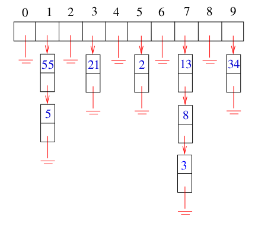

# 6 Hashing

## Hash Tables

- hash tables are a very practical way to maintain a dictionary
- the idea is simply that looking an item up in an array is Θ(1) once you have its index
- a hash function is a mathematical function which maps keys to integers

Collisions
- collisions are the set og keys mapped to the same bucket
- if the keys are uniformly distributed, then each bucket should contain very few keys
- the resulting short lists are easily searched

Collision Resolution by Chaining
- chaining is easy, but devotes a considerable amount of memory to pointers, which could be used to make the table larger
- insertion, deletion, and query reduce to the problem in linked lists
- if the n keys are distributed uniformly in a table of size m/n, each operation takes O(m/n) time

Open Addressing
- we can dispense with all these pointers by using an implicit reference derived from a simple function
- if the space we want is filled, we try the next location:
  - sequentially h, h + 1, h + 2, ...
  - quadratically h, h + 1^2, h + 2^2, h + 3^2, ...
  - linearly h, h + k, h + 2k, h + 3k, ...
- deletion in an open addressing scheme is ugly, since removing one element can break a chain of insertions, making some elements inaccessible

Hash Functions
- it is the job of the hash function to map keys to integers
- a good hash function:
  - is cheap to evaluate
  - tends to use all positions from 0...M with uniform frequency
- the first step is usually to map the key to a big integer, for example:

Modular Arithmetic
- this large number must be reduced to an integer whose size is between 1 and the size of our hash table
- one way is bt h(k) = k mod M, where M is best a large prime not too close to 2^i - 1, which would just mask off the high bits
- this works on the same principle as a roulette wheel

The Birthday Paradox
- reason why we need linked lists
- no matter how good our hash function is, we had better be prepared for collisions, because of the birthday paradox
- the probability of there being no collisions after n insertions into an m element table is:

- when m = 366, this probability sinks below 1/2 when n = 23 and to almost 0 when N>=50

## Applications of Hashing

Performance on Set Operations
- with either chaining or open addressing
  - Search: O(1) expected, O(n) worst case
  - Insert: O(1) expected, O(n) worst case
  - Delete: O(1) expected, O(n) worst case
  - Min, Max, Predecessor, and Successor are Θ(n+m) expected and worst case
- pragmatically, a hash table is often the best data structure to maintain a dictionary
- however, the worst case time is unpredictable
- the best worst case bounds come from balanced binary trees

Hashing, Hashing, and Hashing
- Udi Manber says that the three most important algorithms at Google are hashing, hashing, and hashing
- hashing has a variety of clever applications beyond just speeding up search, by giving you a short but distinctive representation of a larger document
  - is this new document different from the rest in a large corpus? hash the new document and compare it to the hash codes of the corpus
  - is part of this document plagiarized from part of a document in a large corpus? hash overlapping windows of length w in the document and the corpus, if there is a match of hash codes, there is possibly a text match
  - how can I convince you that a file isn't changed? check if the cryptographic hash code of the file you give me today is the same as that of the original, any changes to the file change the hash code

Hashing as a Representation
- custom designed hashcodes can be used to bucket items by a canonical representation
  - which five letters of the alphabet can make the most different words
  - hash each word by the letters it contains skiena -> aeikns, observe that dog and god collide
- proximity preserving hashing techniques put similar items in the same bucket
- use hashing for everything, except worst-case analysis

## The Rabin-Karp algorithm

Substring Pattern Matching
- input: A text string t and a pattern string p
- problem: does t contain the pattern p as a substring, and if so where?

Brute Force Search
- the simplest algorithm to search for the presence of pattern string p in text t overlays the pattern string at every position in the text, and checks whether every pattern character matches the corresponding text character
- this runs in O(nm) time, where n = |t| and m = |p|

String Matching via Hashing
- suppose we compute a given hash function on both the pattern string p and the m-character substring starting from the ith position of t
- if these two strings are identical, clearly the resulting hash values will be the same
- if the two strings are different, the hash values will almost certainly be different
- these false positives should be so rare that we can easily spend the O(m) time it takes to explicitly check the identity of two strings whenever the hash values agree

The Catch
- this reduces string matching to n - m + 2 hash value computations (the n - m + 1 windows, plus one hash of p), plus what should be a very small number of O(m) time verification steps
- the catch is that it takes O(m) time to compute a hash function on an m-character string, and O(n) such computations seems to leave us with an O(mn) algorithm again

The Trick
- look closely at out string hash function, applied to the m characters starting from the jth position of string S:

- a little algebra reveals that

- thus, we know the hash value from the j position, we can find the hash value from the (j+1)st position for the cost of two multiplications, one addition, and one subtraction
- this can be done in constant time