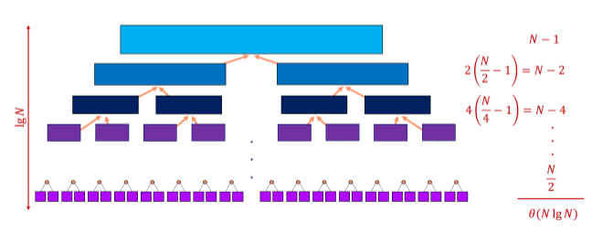
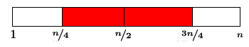

# 8 Mergesort / Quicksort

## Mergesort

- recursive algorithms are based on reducing large problems into small ones
- a nice recursive approach to sorting involves partitioning the elements into two groups, sorting each of the smaller problems recursively, and then interleaving the two sorted lists to totally order the elements


```c++
void mergesort_(item_type s[], int low, int high) {
  int middle; /* index of middle element */
  if (low < high) {
    middle = (low + high) / 2;
    mergesort_(s, low, middle);
    mergesort_(s, middle + 1, high);
    merge(s, low, middle, high);
  }
}
```

Merging Sorted Lists

- the efficiency of mergesort depends upon how efficiently we combine the two sorted halves into a single sorted list
- this smallest element can be removed, leaving two sorted lists behind, one slightly shorter than before
- repeating this operation until both lists are empty merges two sorted lists (with a total of n elements between them) into one, using at most n - 1 comparisons or O(n) total work

```c++
void merge(item_type s[], int low, int middle, int high) {
  int i; /* counter */
  queue buffer1, buffer2; /* buffers to hold elements for merging */
  init_queue(&buffer1);
  init_queue(&buffer2);
  for (i = low; i <= middle; i++) enqueue(&buffer1, s[i]);
  for (i = middle + 1; i <= high; i++) enqueue(&buffer2, s[i]);
  i = low;
  while (!(empty_queue(&buffer1) || empty_queue(&buffer2))) {
    if (headq(&buffer1) <= headq(&buffer2)) {
      s[i++] = dequeue(&buffer1);
    } else {
      s[i++] = dequeue(&buffer2);
    }
  }
  while (!empty_queue(&buffer1)) {
    s[i++] = dequeue(&buffer1);
  }
  while (!empty_queue(&buffer2)) {
    s[i++] = dequeue(&buffer2);
  }
}
```

Mergesort Analysis
- a linear amount of work is done merging along all levels of the mergesort tree
- the height of this tree is O(log n)
- thus, the worst case time is O(n log n)



Divide and Conquer
- divide and conquer is an important algorithm design technique used in mergesort, binary search, the fast Fourier transform (FFT), and Stassen's matrix multiplication algorithm
- we divide the problem into two smaller subproblems, solve each recursively, and then meld the two partial solutions into one solution for the full problem
- when merging takes less time than solving the two subproblems, we get an efficient algorithm

T(n) = 2 * T(n / 2) + theta(n) -> T(n) = theta(n log n)

External Sorting
- which O(n log n) algorithm you use for sorting doesn't matter much until n is so big the data does not fit in memory
- mergesort proves to be the basis for the most efficient external sorting programs
- disks are much slower than main memory, and benefit from algorithms that read and write data in long streams - not random access

## Quicksort

Quicksort
- in practice, the fastest internal sorting algorithm is quicksort, which uses partitioning as its main idea
- partitioning places all the elements less than the pivot in the left part of the array, and all the elements greater than the pivot in the right part of the array
- the pivot fits in the slot between
- note that the pivot element ends up in the correct place in the total order


Partitioning the Elements
- we can partition an array about the pivot in one linear scan, by maintaining three sections: < pivot, > pivot, and unexplored
- as we scan from left to right, we move the left bound to the right when the element is less than the pivot
- otherwise, we swap it with the rightmost unexplored element and move the right bound one step closer to the left

Why partition?
- since the partitioning step consists of at most n swaps, takes time linear in the number of keys; but what does it buy us?
  - the pivot element ends up in the position it retains in the final sorted order
  - after a partitioning, no element flops to the other side of the pivot in the final sorted order
- thus we can sort the elements to the left of the pivot and the right of the pivot independently, giving us a recursive sorting algorithm

```c++
void quicksort(item_type s[], int l, int h) {
  int p; /* index of partition */
  if ((h - l) > 0) {
    p = partition(s, l, h);
    quicksort(s, l, p - 1);
    quicksort(s, p + 1, h);
  }
}
```

```c++
int partition(item_type s[], int l, int h) {
  int i; /* counter */
  int p; /* pivot element index */
  int firsthigh; /* divider position for pivot element */
  p = h; /* select last element as pivot */
  firsthigh = l;
  for (i = l; i < h; i++) {
    if (s[i] < s[p]) {
      swap(&s[i], &s[firsthigh]);
      firsthigh++;
    }
  }
  swap(&s[p], &s[firsthigh]);
  return(firsthigh);
}
```

Best Case for Quicksort
- since each element ultimately ends up in the correct position, the algorithm correctly sorts; but how long does it take?
- the best case for divide and conquer algorithms comes when we split the input as evenly as possibly, thus in the best case, each subproblem is size n/2
- the partition step on each subproblem is linear in its size
- thus, the total effort in partitioning the 2^k problems of size n/2^k is O(n)
- the total partitioning on each level is O(n), and it takes log n levels of perfect partitions to get to single element subproblems
- when we are down to single elements, the problems are sorted
- thus, the total time in the best case is O(n log n)

Worst Case for Quicksort
- suppose instead our pivot element splits the array as unequally as possible
- thus instead of n/2 elements in the smaller half, we get zero, meaning that the pivot element is the biggest or smallest element in the array
- now we have n-1 levels instead of log n, for a worst case time of theta(n^2), since the first n/2 levels each have >=n/2 elements to partition
- to justify its name, quicksort had better be good in the average case
- showing this requires some intricate analysis

Average Case for Quicksort
- suppose we pick the pivot element at random in an array of n keys



- half the time, the pivot element will be from the center half of the sorted array
- whenever the pivot element is from positions n/4 to 3n/4, the larger remaining subarray contains at most 3n/4 elements

- O(n) work is done partitioning on each level
- average time is O(n log n)

## Randomized Quicksort

- quicksort is good on average, but bad on certain worst case instances
- there is a worst case set of data that's make the algorithms run in O(n^2)
- the pivot is picked at random
- now it can work on any set of data, as not matter the order, we have an equivalent probability of selecting a good pivot

Randomized GUarantees
- randomization is a very important and useful idea
- by either picking a random pivot or scrambling the permutation before sorting it, we can say:
  - with high probability, randomized quicksort runs in theta(n log n) time
- where before, all we could say was
  - with a random input data, quicksort runs in expected theta(n log n) time

Importance of randomization
- since the time bound does not depend upon the input distribution, this means that unless we are extremely unlucky (as opposed to ill prepared) we will certainly get good performance
- randomization is a general tool to improve algorithms with bad worst case but good average case complexity
- the worst case is still there, but we almost certainly won't see it

## Quicksort vs Heapsort

- since heapsort is theta(n log n) and selection sort is theta(n^2), there is no debate about which will be better for decent sized files
- when quicksort is implemented well, it is typically 2-3 times faster than mergesort or heapsort
- the primary reason is that the operations in the innermost loop are simpler
- since the difference between the two programs will be limited to a multiplicative constant factor, the details of how you program each algorithm will make a big difference
